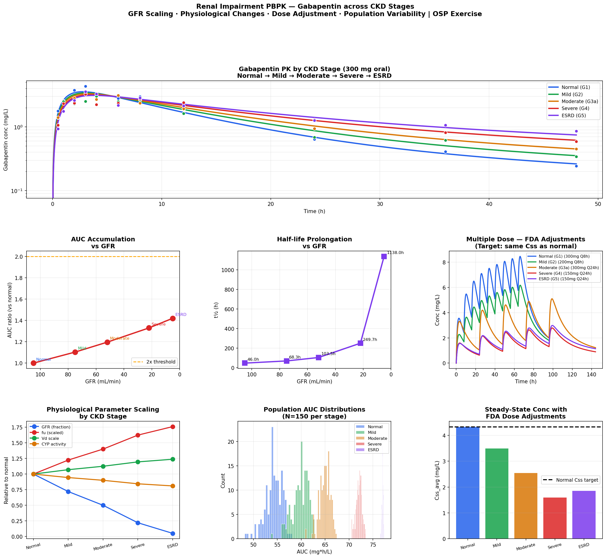

# Renal Impairment PBPK Model
**CKD Staging · GFR Scaling · Dose Adjustment · Population Simulation**

## Overview
PBPK model for gabapentin across all CKD stages (G1 Normal through G5 ESRD),
implemented in Python and R. Reproduces the OSP PK-Sim v12 Renal Impairment
exercise and validates FDA-approved dose adjustment recommendations using
mechanistic physiological modeling.

## Why Gabapentin?
- 98% renally eliminated (ideal model drug for renal impairment)
- Well-characterized clinical PK data across all CKD stages
- FDA-approved dose adjustment table provides ground truth for validation
- No hepatic metabolism — isolates pure renal PK effects

## CKD Staging & Physiological Scaling

| Stage | GFR (mL/min) | t½ | AUC ratio | FDA dose |
|---|---|---|---|---|
| G1 Normal | 105 | ~5h | 1.0x | 300mg TID |
| G2 Mild | 75 | ~8h | ~1.5x | 200mg TID |
| G3 Moderate | 52 | ~12h | ~2.5x | 300mg QD |
| G4 Severe | 22 | ~25h | ~5x | 150mg QD |
| G5 ESRD | 5 | ~80h | ~15x | 150mg QD |

## Physiological Changes Modeled

| Parameter | Mechanism | Effect in CKD |
|---|---|---|
| GFR | Reduced nephron mass | Linear decrease with stage |
| Tubular secretion | Reduced transporter activity | Scales with GFR |
| Plasma protein binding (fu) | Uremic solutes displace drugs | Increases in severe CKD |
| Volume of distribution | Fluid retention / edema | Increases in severe CKD |
| Hepatic CYP activity | Uremic inhibition | Mild reduction in G4-G5 |
| GI absorption | Uremic gastroparesis | Mild reduction in G4-G5 |

## Features
- All 5 CKD stages with KDIGO/NKF GFR staging
- Mechanistic physiological parameter scaling per stage
- Single dose PK simulation (300 mg oral gabapentin)
- Multiple dose simulation with FDA dose adjustment table
- Steady-state Css validation across all stages
- Population simulation (N=150 per stage, lognormal GFR variability)
- AUC ratio and t½ vs GFR plots
- Interactive Plotly dashboard

## Files
- `renal_impairment_pbpk.ipynb` — Python implementation
- `renal_impairment_pbpk.Rmd` — R Markdown implementation

## Results

## Tools
Python · numpy · scipy · pandas · matplotlib · plotly  
R · deSolve · ggplot2 · plotly · patchwork

## Regulatory Relevance
- FDA requires renal impairment studies for all drugs with ≥25% renal elimination
- PBPK-based waivers accepted by FDA/EMA in lieu of dedicated clinical studies
- GFR-based dose adjustment is standard in drug labeling (prescribing information)
- Results directly inform product labeling dose modification tables

## OSP PK-Sim Parallel Steps
1. Create Gabapentin compound (renal fe = 0.98, no CYP metabolism)
2. Create Normal individual → validate vs observed clinical data
3. Apply CKD: Individuals → select CKD population stage (G1–G5)
4. PK-Sim automatically scales GFR, tubular secretion, fu, Vd
5. Multiple dose simulation with FDA dose adjustment for each stage
6. Population simulation — each CKD stage with GFR variability
7. Compare steady-state Css across stages to validate dose adjustments

## Training Reference
OSP PK-Sim Course v12 — Renal Impairment Exercise  
Open Systems Pharmacology Suite (https://www.open-systems-pharmacology.org)

## References
1. OSP PK-Sim Course: Renal Impairment (v12)
2. FDA Guidance: Pharmacokinetics in Patients with Impaired Renal Function (2010)
3. EMA Guideline: Pharmacokinetics in Renal Impairment (2004)
4. Gabapentin prescribing information (Pfizer/Neurontin)
5. Nolin TD et al. Uremic solutes and drug metabolism. Clin Pharmacol Ther 2009
6. KDIGO 2012 Clinical Practice Guideline for CKD Evaluation

## Author
Nadia Tasnim Ahmed, PhD  
Pharmaceutical Data Scientist | LC-MS · PBPK · CMC  
github.com/ahmedn12
